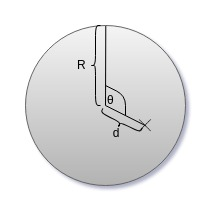

# Resumen {-}

Imaginemos por un momento que necesitamos ir de un sitio a otro en nuestra ciudad y disponemos de un sistema de bicicletas por estaciones. Como sabemos los sistemas de bicicletas públicas ofrecen a los usuarios bicis en estaciones situadas en puntos concretos de la ciudad para poder utilizarlas como medio de transporte de un punto a otro. Estas estaciones están situadas en lugares concretos de la ciudad y podemos desplazarnos de un sitio a otro, cogiendo las bicis en una estación y dejándolas en otra cerca de nuestro destino. 

Con la llegada de los smartphones, la utilización de estos sistemas es más sencilla, ya que los usuarios pueden disponer de mucha información del sistema a través de aplicaciones software instaladas en estos dispositivos. Estas aplicaciones pueden ofrecerle al usuario estaciones donde coger y dejar una bici en función del destino al que quieran ir. En sistemas como BiciMad es posible reservar bicicletas, ver el estado actual de todas las estaciones, etc. 

En ciertas ocasiones, este sistema puede saturarse en estaciones concretas, haciendo que la experiencia de los usuarios que quieran utilizarlo empeore, por lo que es necesario aplicar soluciones. Hay que plantear posibles estrategias de balanceo de prever esas situaciones problemáticas. El objetivo es balancear las estaciones para que las estas puedan ser utilizadas para coger o devolver una bici el mayor tiempo que sea posible, minimizando los costes.

Muchas soluciones y estrategias de balanceo son muy difíciles de probar directamente en el sistema, ya que habría que implementar muchas cosas en un sistema en funcionamiento, y quizás nuestra estrategia de balanceo no sea la más adecuada, ocasionando gastos innecesarios y empeorando la experiencia de los usuarios. Para probar la viabilidad de las estrategias que se planteen es necesario disponer de un **simulador** capaz de probar estos sistema y algoritmos de balanceo propuestos. 

En eso se centra este trabajo, en la implementación de un simulador capaz de recrear de la manera más realista posible, un sistema de bicis compartidas. Este simulador deberá permitir la posibilidad de tener diferentes tipos de usuario, implementar un sistema de recomendaciones, implementar un sistema de incentivos y poder probar cualquier sistema de bicis públicas en cualquier lugar del mundo. En definitiva, crear un simulador que nos permita crear, simular y analizar situaciones reales e implementar sistemas de balanceo para comprobar su viabilidad. Se crearán archivos de configuración para crear situaciones con estaciones y ciudades reales. Posteriormente tras las simulaciones se podrán analizar los datos obtenidos y visualizarlos para comprobar su eficacia.

>

# Introducción

En este capítulo se darán a conocer las motivaciones que llevaron a la realización de este proyecto, el contexto del mismo y los objetivos planteados.

## Motivación

El proyecto consiste en la realización de un simulador de sistemas de bicis compartidas en entornos urbanos, como por ejemplo BiciMad[^1] en Madrid, o Vèlib[^2] en Francia.

[^1]: BiciMad: [https://bicimad.com/](https://bicimad.com/).
[^2]: Vèlib: [https://www.velib-metropole.fr/](https://www.velib-metropole.fr/).

La necesidad de alentar a las personas a utilizar vías alternativas de transporte a las comúnmente usadas es cada vez más necesario. El aumento de la población en las grandes ciudades, el aumento de CO2 son hechos que nos obligan a pensar como cambiar y/o mejorar los medios de transporte público.

Los sistemas de bicis compartidas instaladas en las grandes ciudades son una muy buena opción a la hora de buscar alternativas de movilidad. Estos sistemas permiten a los ciudadanos moverse por distintos puntos de la ciudad alquilando una bici de cualquiera de las estaciones disponibles y devolviéndola en otra estación diferente.

Pero el problema no solo se centra en promover el uso de estos sistemas, sino que va más allá. Uno de los más importantes es el balanceo de bicicletas entre estaciones. Algunas situaciones que pueden producir este desequilibrio son:

- Eventos especiales.
- Horas punta.
- Aglomeraciones inesperadas.

Para evitar estos problemas es necesario tener un control sobre los recursos disponibles, manejarlos y distribuirlos de la manera más eficiente posible. Llevar a cabo nuevas ideas en un sistema de alquiler de bicis y probarlo en la realidad, puede ser muy tedioso y costoso.

Es por esto por lo que surge la necesidad de un simulador, con el que podamos poner a prueba todos estos tipos de sucesos, crear distintos tipos de usuarios, probar sistemas de recomendaciones o de incentivos, para que los usuarios puedan ayudar a balancear el sistema.

Un simulador es útil para el estudio de estos problemas donde se pueda probar en cualquier ciudad del mundo distintos sistemas, algoritmos e ideas posibles de implementar para incentivar su uso, mejorar el sistema, o incluso probar soluciones en algunas ciudades y trasladarlas a otras.

Por otro lado, no solo está la posibilidad de utilizar el simulador como una herramienta para sacar conclusiones respecto al funcionamiento del sistema en sí, sino que además cabe la posibilidad de analizar el comportamiento de diferentes tipos de usuario en este tipo de sistemas. Para ello es necesario que se pueda añadir a nivel de código usuarios para que cualquier persona con conocimientos de programación pueda implementar sus propios algoritmos de comportamiento del simulador.

Adicionalmente, no debería ser un simulador único e invariable, sino que debe ser posible su modificación y adaptación a las necesidades de cada investigación, pero dentro del ámbito de los sistemas de bicis compartidas.

## Contexto

Para definir las diferentes partes de el simulador, es necesario tener una visión general del sistema de bicis en la realidad.

{#fig:1}

Podemos distinguir claramente en la [Figura 1](#fig:1) tres partes principales dentro del sistema de bicis compartidas:

- Infraestructura física con estaciones y bicis (Amarillo).
- Usuarios con Smartphone y App del sistema (Rojo).
- Sistema de recomendaciones y gestión del sistema (Azul).

Estas tres partes diferenciadas constituyen tres partes importantes dentro del desarrollo del simulador. El **núcleo**, que incluirá la infraestructura y como deben los usuarios interactuar con el sistema, las implementaciones de los **usuarios** que implementarán distintas formas de actuar dentro del sistema, y el **sistema de recomendaciones** que podrá influir en el comportamiento de los usuarios.

Los usuarios hacen uso de la infraestructura cuando cogen o dejan una bici y también hacen uso del sistema de recomendaciones a través de la App, para reservar una bici o un hueco, ver el estado de una estación, o quizás hacer caso a alguna de las sugerencias de la App.

Vemos que hay una interacción continua entre usuarios e infraestructura. El sistema de recomendaciones puede influenciar en las decisiones finales del usuario.

En el desarrollo de este simulador hemos participado varias personas hasta la fecha de publicación de esta memoria, las cuales han realizado diferentes partes, aunque parte de este desarrollo ha sido realizado de forma conjunta debido a la necesidad de tener una base común, que serían el núcleo y algunos estándares definidos.

Con esta visión global del sistema se especifica una serie de objetivos que se detallan a continuación.

## Objetivos

Antes de plantear que objetivos perseguir, hay que analizar que necesidades va a tener el simulador en el futuro y con que fín se va a utilizar en términos globales. Podríamos distinguir varios objetivos si hablamos de la totalidad del simulador:

- Probar algoritmos de balanceo y predicción de demanda en un sistema de bicicletas compartido.
- Implementar sistemas de recomendaciones e incentivos para optimizar la demanda.
- Plantear nuevas distribuciones de estaciones sobre una ciudad.

Basado en estos objetivos globales se derivan los siguientes objetivos más concretos para el desarrollo:

- Recrear infraestructuras reales en ciudades reales.
- Generar usuarios en cualquier punto de la ciudad.
- Generación de usuarios versátil y que puedan seguir distribuciones (Poisson).
- Poder definir qué tipos de usuarios queremos en el sistema y parametrizarlos para que puedan tener comportamientos variados.
- Poder definir qué tipos de usuarios queremos en el sistema y parametrizarlos para que puedan tener comportamientos variados.
- Facilidad para crear configuraciones (GUI).
- Creación de distintos tipos de usuario, con diferentes comportamientos que respondan de forma distinta a las situaciones dadas y las recomendaciones.
- Simulación realista.
- Análisis de los datos para probar los diferentes algoritmos.

En general el simulador tiene que ser capaz de recrear situaciones reales basadas en entornos reales, con infraestructuras existentes o que puedan existir en el mundo real. Es decir, uno de los objetivos básicos es dotar al simulador de mecanismos ágiles para poder crear configuraciones de diferentes situaciones.

Además estas configuraciones tienen que poder ser generadas con cierta independencia del simulador, añadiendo la posibilidad de que nuevos desarrolladores puedan crear sus propias herramientas que generen casos para la simulación y ofreciendo una interfaz agradable para la realización de simulaciones.

En el contexto global del desarrollo, la parte que ha correspondido al tema de este trabajo que se presenta en mayor detalle es:

- Configuración.
- Interfaz de usuario.
- Desarrollo ágil de nuevos usuarios, sistemas de recomendación, generación de usuarios...
- Extensibilidad.

## Metodología

Este software se ha realizado en un grupo de varias personas, por lo que necesitamos de una metodología para organizarnos. Podríamos considerar que estamos utilizando Scrum[@bib1], pero para los más puristas en cuanto a metodologías software no sería considerado como tal, ya que utilizamos una estructura organizativa horizontal, que suele ser más propio de empresas que venden su propio producto software o, como es el caso, en desarrollos de software para investigación. El equipo de desarrollo tiene un contacto directo con el cliente(que serían nuestros tutores de proyecto) y hay casi una comunicación total día a día con ellos, sin roles intermediarios. Sin embargo, sí que se tienen reuniones cada semana en el equipo para ver cómo avanza el proyecto, retrospectivas, prototipos, integración, pruebas... no obstante, como no aplicamos todas las reglas de Scrum, consideraremos que el desarrollo se está realizando con una metodología iterativa e incremental tal y como se muestra en la [Figura 2](#fig:2)

{#fig:2}

En este modelo, primero se realiza un análisis de los requisitos que se van a necesitar para cada iteración. Después del desarrollo de estos, se hacen pruebas y para finalizar se integra con el resto del sitema.

Cada 2 semanas realizamos una iteración donde se realizan todos los pasos comentados anteriormente, donde todo el equipo de desarrollo decide qué requisitos son más críticos e importantes, bugs y releases. En base a estas decisiones y utilizando herramientas online como Trello[^3], se gestiona que tareas debe realizar cada uno.

[^3]: Es un tablero online donde se pueden crear, asignar y clasificar tareas, de tal modo que todo el equipo tiene una visión global del estado actual de desarrollo que se está creando.

Un desarrollo iterativo e incremental ofrece varias ventajas con respecto a otras metodologías como puede ser el desarrollo en cascada. Una de las ventajas que ofrece es la entrega de software usable a mitad de desarrollo, mientras que en el modelo en cascada cada fase del proceso debe ser finalizada (firmada) para pasar a la siguiente fase. El desarrollo de software no es lineal y esto crea dificultades si se utiliza una metodología en cascada[@bib2].

Cada cierto tiempo realizamos una release. Utilizamos un formato de versiones semántico[@bib3] del tipo X.Y.Z donde, X, Y y Z son números enteros mayores que 0.

X se corresponde a la version mayor (cambios grandes que modifican parte o gran parte de la funcionalidad). Y se corresponde a la version menor(pequeños cambios, correción de bugs) y Z, que son micro versiones (parches, pequeños bugs criticos...)

# Descripción informática

El presente capítulo aborda toda la fase de desarrollo del proyecto, desde la especificación de requisitos, el diseño y la implementación del mismo, contextualizando el trabajo realizado por todos en el simulador y explicando con más detalle nuestra parte correspondiente.

## Especificación de requisitos

Antes de comenzar las iteraciones y primeros prototipos de nuestro proyecto, es necesario crear una especificación de requisitos clara y concisa. Vamos a seguir algunas de las recomendaciones del estándar IEEE830[@bib6] para ello. En un desarrollo iterativo e incremental ágil debemos tener muy en cuenta que los requisitos puedan ser lo más modificables posibles.

### Perspectiva general del producto

Para examinar y definir en detalle las distintas especificaciones de nuestro simulador, debemos introducir un poco las necesidades globales del simulador en general.

Necesitamos un software que sea capaz a partir de un estado inicial de simular situaciones reales y debe permitir visualizar y dar una serie de datos correspondientes de la simulación. El simulador tiene que mostrar estos datos a través de un histórico que posteriormente se utilizará para analizar los resultados del sistema de recomendaciones y los algoritmos implementados.

En resumen, el simulador tiene que ser capaz de a partir de unos datos de configuración iniciales, generar un histórico con los resultados de la simulacion para comprobar el comportamiento de los distintos algoritmos de balanceo implementados.

Este TFG se centrará en dos partes:

- Configuración: Sera diseñado con el objetivo de inicializar el simulador utilzando la ubicación de una ciudad real, poder generar usuarios en zonas especificas, parametrizar valores globales de la simulación, ubicar estaciones en cualquier punto y parametrizar también que tipos de usuarios se van a utilizar en la simulaciones, en que zonas y con qué distribución aparecerán.

- Participación en el desarrollo global, que incluye la separación del simulador en módulos, la aplicación de ciertos patrones de diseño y la implementación de la parte gráfica de configuración y simulación.

### Definición de acrónimos y abreviaturas

En esta sección se describen los términos y abreviaturas utilizados para la especificación de requisitos:

- Sistema de bicis compartidas (SBC): Infraestructura (estaciones, bicis).

- Sistema de recomendaciones (SDR): Parte del simulador encargado de recomendar a los usuarios estacionescon la finalidad de balancear el sistema.

- Usuario simulado (US): Agente simulado que interactua dentro del sistena de bicis compartidas y que pueden hacer uso del sistema de recomendaciones y el sistema de bicis compartidas.

- Alquiler: Acción que realizan los usuarios simulados al coger una bici.

- Reservar: Acción que realizan los usuarios al reservar un hueco o una bici antes de llegar a una estación.

- Histórico: Resultado de una simulación.

- Interfaz de usuario (GUI).

### Tipos de usuario:

Solo tendríamos un tipo de usuario, que serían los investigadores, profesores o cualquier persona que quiera hacer uso de nuestro simulador. Podrán o no tener conocimientos de programación, pero los usuarios con conocimientos de desarrollo podrán modificar y crear suarios de una forma mucho más precisa dentro del código fuente.

### Requisitos funcionales

En esta sección se expondrán los requisitos de mi parte dentro de este proyecto. Nótese que estos requisitos han ido cambiando a lo largo del desarrollo iterativo e incremental

**Requisito funcional 1**

_Fichero de configuración global del SBC_: La simulación deberá partir de una serie de parámetros globales en un fichero de texto. Partiremos de las siguientes necesidades, aunque pueden cambiar, quitarse o añadirse según el progreso y uso del simulador. El fichero de configuración deberá especificar:

- Un parametro (semilla) para la generación de sucesos aleatorios. Esta semilla permite que los sucesos aleatorios sean los mismos en el momento en que se ejecuten.

- Parametro de tiempo total de simulación

- Un área donde sucederá la simulación.

**Requisito funcional 2**

_Fichero de configuración de estaciones_. Se podrá mediante un fichero de configuración, disponer para la simulación de un conjunto finito  de estaciones. El  archivo de configuración deberá especificar:

- Las bicis disponibles en las estaciones.

- Número total de huecos en cada estación.

- Punto geográfico de su ubicación real o ficticia.

**Requisito funcional 3.1**

_Fichero de configuración para los US_: La configuración deberá proporcionar un mecanismo con el cual se puedan generar usuarios en distintos puntos geográficos. De momento los más importantes son:

- Distribución exponencial (Poisson).

- Único US.

**Requisito funcional 3.2**

_Configuración de usuarios independiente:_ La configuración de entrada de los US en el SBC debe ser independiente del simulador, es decir, deberá generar un fichero con los usuarios que van a aparecer en la simulación. Por lo tanto, habrá dos ficheros de configuración:

- Fichero de configuración con puntos de entrada y distribuciones.

- Ficheros de configuración con usuarios generados según el fichero con puntos de entrada.

Los US podrán o no tener parámetros de configuración que modifiquen su comportamiento de facto. Los parámetros dependerán del tipo de US que se quiera.

**Requisito funcional 3.3**

_Generador de usuarios_: Del requisito anterior podemos deducir que deberña haber un generador de US que reciba el fichero de configuración con puntos de entrada y distribuciones y nos genere un fichero de configuración con US siguiendo dichas distribuciones o reglas definidas.

**Requisito funcional 4**

_Procesador de la configuración_: En el simulador deberá haber un procesador para la configuración para las configuraciones descritas que sea capaz de preparar todo el sistema para su correspondiente ejecución.

**Requisito funcional 5**

_Gestor de rutas_: Los US deberán tomar rutas reales y decisiones basándose en el mapa y la situación del SBC, Estas rutas serán posterior,emte guardadas en el histórico para su visualización.

**Requisito funcional 6**

_Herramientas GUI_: La GUI deberá proporcionar las siguientes herramientas:

- Crear y cargar configuraciones

- Visualizar históricos

- Analizar y exportar datos.

Además debe permitir crear y cargar configuraciones en la GUI, deberá poder crear configuraciones a través de un mapa. Los elementos de la configuración que se vayan añadiendo, deberán verse en un mapa y en una vista en forma de árbol para que sea accesible.

### Requisitos no funcionales

**Requisito no funcional 1**

Interfaz de usuario dinámica: Al añadir o quitar parámetros de configuración a los usuarios, añadir o quitar tipos de usuarios, los formularios de la GUI para configurar la simulación deben ser lo más dinámicos posibles, para agilizar el desarrollo.

**Requisito no funcional 2**

El simulador debe ser multiplataforma, pudiendo así ser utilizado y desarrollarlo en las plataformas GNU/Linux, Windows y MacOS.

**Requisito no funcional 3**

El diseño del simulador y el código debe ser lo más sencillo posible y aportar facilidades a la hora de añadir, modificar o alterar implementaciones de usuarios y de parámetros de configuración, así como de métodos de generación de usuarios.

**Requisito no funcional 4**

Tanto el formato de los ficheros de configuración como el del histórico deben ser independientes, es decir, la configuración podrá ser creada y el histórico leído por otro sofware independientemente del simulador. Se utilizará el formato JSON y deberá contar de un sistema para la verificación de datos.

## Análisis

Para ir formando las partes de nuestro simulador, vamos a partir de lo siguiente:

1. En el sistema de bicis sólo se pueden realizar ciertas **acciones**.

2. Los usuarios pueden elegir entre esas acciones posibles dependiendo de su **estado**, que tipo de usuario sea, y el sistema de recomendaciones.

3. El sistema de bicis se encuentra en un lugar en específico y, si se tienen datos anteriores del sistema, se pueden deducir distribuciones de aparación de los usuarios en el sistema. Por lo cual contamos con un **estado inicial**

4. Cada persona que utiliza el sistema es distinta, el uso del SBC es diferente para cada tipo de usuario.

5. Cada simulación debe producir un histórico, y con este histórico se debe poder **visualizar la simulación** y **analizar los datos resultantes**.

Partiendo de esta pequeña analogía, con los puntos anteriormente citados vamos a ir mencionando las distintas partes de nuestro simulador que se corresponden con cada punto anterior en el SBC real.

### Núcleo

En el núcleo definiremos como se ejecutarán las acciones de las entidades en el simulador. Para definir como se van a ejecutar estas acciones vamos a plantear un diagrama de flujo de las posibles acciones del usuario dentro del sistema.

Este flujo de decisiones deberá seguir cualquier usuario del sistema. Las decisiones que tomará el usuario para realizar unas acciones u otras vendrán determinadas por el estado del SBC y por las implementaciones concretas de los usuarios implementados.

En la siguiente figura se puede ver el flujo de decisiones de un usuario dentro del sistema. 

{#fig:3}

### Generación de puntos aleatorios en un circulo de la superficie de una esfera

En primer lugar, debemos partir desde una base sencilla. Un primer acercamiento a la solución de este problema, sería la generación de puntos aleatorios en un círculo plano bidimensional con puntos cartesianos. 

{#fig:40}

En la [figura 40](#fig:40), R es el radio del circulo, $d$ es un valor aleatorio uniforme entre 0 y R, y $\theta$ es un angulo cuyo valor es una valor aleatorio entre 0 y 2$\pi.$ Una posible solución sería generar los puntos en base a la siguiente formula.

$$
d = rand(0, R);  \; \;
\theta = rand(0, 2\pi)\;\;\;\;\;\;\;\;(1)
$$

Sin embaro esto nos va a dar como resultado más cantidad de puntos en zonas cercanas al centro de la circunferencia. Esto se debe a que a que a medida que el radio aumenta, la superficie en la que se puede representar el punto es mucho mayor. Debemos tener en consideración este dato a la hora de generar $d$ aleatoriamente.

Por lo tanto lo que haremos es generar $d$ en base a la siguiente formula para el radio [@bib4].

$$
d = R*\sqrt(rand(0, 1))\;\;\;\;\;\;\;\;(2)
$$

Donde rand(0, 1) es un funcion que devuelve un valor uniforme entre 0 y 1, y R es el radio del circulo. En la [figura 50](#fig:50) se puede ver como influye la generación de puntos utilizando la formula descrita anteriormente. El círculo en la derecha, corresponde a una generación correcta de puntos.

{#fig:50}

En segundo lugar tenemos que trasladar esta solución a la superficie de la tierra. Los puntos geográficos en la tierra, no se comportan como puntos cartesianos en un plando bidimensional. Supongamos los siguientes puntos geográficos, siendo $x1, x2, x3$ y $x4$ latitudes y $y1, y2, y3$ y $y4$ longitudes:

$$
p1 = (x1,y1); \; \;
p2 = (x2, y2); \; \;
t1 = (x3, y3); \; \;
t2 = (x4, y4); \;\;\;\;\;\;\;\;(3)
$$

Supongamos ahora que los puntos p1 y p2 se encuentran cercanos al ecuador, y los puntos t1 y t2 se encuentran cercanos a los polos. Además supongamos tambien que: 

$$
x2 - x1 = x4 - x3; \; \;
y2 - y1 = y4 - y3 \;\;\;\;\;\;\;\;(4)
$$

Si consideramos los puntos p1, p2, t1 y t2 como puntos cartesianos, la distancia sería la misma, pero como son puntos geométricos, al ser la tierra elipsoidal, son distancias diferentes. 

Dado un punto inicial, un ángulo de dirección y una distancia, podemos calcular un nuevo punto geográfico. Tenemos como punto inicial $\varphi_1$"(latitud) y $\lambda_1$(longitud), un angulo $\theta$ (en sentido horario desde el norte) y una distancia $d$. Además necesitaremos tambien conocer la distancia angular, que sería $\delta$ = d / R, donde R es erl radio de la tierra.

Aplicando la siguiente fórmula[@bib5] obtendríamos el punto $(\varphi_2, \lambda_2)$:

$$
\varphi_2 = asin(sin\;\varphi_1 * cos\;\delta + cos\;\varphi_1*sin\;\delta \;*cos\;\theta) \;\;\;\;\;\;\;\;(5)
$$

$$
\lambda_2 = \lambda_1 + atan2(sin\;\theta*sin\;\delta*cos\;\varphi_1,\;cos\;\delta - sin\;\varphi_1*sin\;\varphi_2) \;\;\;\;\;\;\;\;(6)
$$

Si aplicamos la formula para generar de forma aleatoria uniforme el ángulo $\theta$ vista en (1) y la distancia $d$ vista en (2), podemos calcular puntos aleatorios en cualquier círculo en la superficie terrestre.
Es posible que esta solución parezca innecesaria, pero no es así. Esta generación de puntos la necesitamos para los Entry Point y estos pueden estar en cualquier ciudad del mundo. Si un usuario define un Entry Point en una ciudad de Suecia, por ejemplo, y no realizamos los calculos de la forma más precisa posible, los usuarios en Suecia se generaran dentro de areas que no serían circulares, sino elipses (en la [figura 60](#fig:60) se puede ver la diferencia entre aplicar el calculo sobre 2 dimensiones y sobre la esfera). Esto se explica debido a que la distancia entre grados no es la misma segun en la zona en la que estemos. Con esto estamos teniendo en cuenta ese factor, y los usuarios generados siempre se generaran en áreas circulares.

{#fig:60}

Prueba de referencia[@item1]

# Referencias
