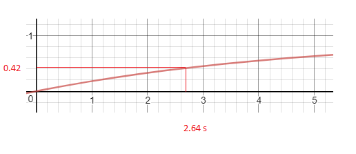

# Resumen {-}

Imaginemos por un momento que necesitamos ir de un sitio a otro en nuestra ciudad y disponemos de un sistema de bicicletas por estaciones. Como sabemos los sistemas de bicicletas públicas ofrecen a los usuarios bicis en estaciones situadas en puntos concretos de la ciudad para poder utilizarlas como medio de transporte de un punto a otro. Estas estaciones están situadas en lugares concretos de la ciudad y podemos desplazarnos de un sitio a otro, cogiendo las bicis en una estación y dejándolas en otra cerca de nuestro destino. 

Con la llegada de los smartphones, la utilización de estos sistemas es más sencilla, ya que los usuarios pueden disponer de mucha información del sistema a través de aplicaciones software instaladas en estos dispositivos. Estas aplicaciones pueden ofrecerle al usuario estaciones donde coger y dejar una bici en función del destino al que quieran ir. En sistemas como BiciMad es posible reservar bicicletas, ver el estado actual de todas las estaciones, etc. 

En ciertas ocasiones, este sistema puede saturarse en estaciones concretas, haciendo que la experiencia de los usuarios que quieran utilizarlo empeore, por lo que es necesario aplicar soluciones. Hay que plantear posibles estrategias de balanceo de prever esas situaciones problemáticas. El objetivo es balancear las estaciones para que las estas puedan ser utilizadas para coger o devolver una bici el mayor tiempo que sea posible, minimizando los costes.

Muchas soluciones y estrategias de balanceo son muy difíciles de probar directamente en el sistema, ya que habría que implementar muchas cosas en un sistema en funcionamiento, y quizás nuestra estrategia de balanceo no sea la más adecuada, ocasionando gastos innecesarios y empeorando la experiencia de los usuarios. Para probar la viabilidad de las estrategias que se planteen es necesario disponer de un **simulador** capaz de probar estos sistema y algoritmos de balanceo propuestos. 

En eso se centra este trabajo, en la implementación de un simulador capaz de recrear de la manera más realista posible, un sistema de bicis compartidas. Este simulador deberá permitir la posibilidad de tener diferentes tipos de usuario, implementar un sistema de recomendaciones, implementar un sistema de incentivos y poder probar cualquier sistema de bicis públicas en cualquier lugar del mundo. En definitiva, crear un simulador que nos permita crear, simular y analizar situaciones reales e implementar sistemas de balanceo para comprobar su viabilidad. Se crearán archivos de configuración para crear situaciones con estaciones y ciudades reales. Posteriormente tras las simulaciones se podrán analizar los datos obtenidos y visualizarlos para comprobar su eficacia.

>

# Introducción

En este capítulo se darán a conocer las motivaciones que llevaron a la realización de este proyecto, el contexto del mismo y los objetivos planteados.

## Motivación

El proyecto consiste en la realización de un simulador de sistemas de bicis compartidas en entornos urbanos, como por ejemplo BiciMad[^1] en Madrid, o Vèlib[^2] en Francia.

[^1]: BiciMad: [https://bicimad.com/](https://bicimad.com/).
[^2]: Vèlib: [https://www.velib-metropole.fr/](https://www.velib-metropole.fr/).

La necesidad de alentar a las personas a utilizar vías alternativas de transporte a las comúnmente usadas es cada vez más necesario. El aumento de la población en las grandes ciudades, el aumento de CO<sup>2</sup> son hechos que nos obligan a pensar como cambiar y/o mejorar los medios de transporte público.

Los sistemas de bicis compartidas instaladas en las grandes ciudades son una muy buena opción a la hora de buscar alternativas de movilidad. Estos sistemas permiten a los ciudadanos moverse por distintos puntos de la ciudad alquilando una bici de cualquiera de las estaciones disponibles y devolviéndola en otra estación diferente.

Pero el problema no solo se centra en promover el uso de estos sistemas, sino que va más allá. Uno de los más importantes es el balanceo de bicicletas entre estaciones. Algunas situaciones que pueden producir este desequilibrio son:

- Eventos especiales.
- Horas punta.
- Aglomeraciones inesperadas.

Para evitar estos problemas es necesario tener un control sobre los recursos disponibles, manejarlos y distribuirlos de la manera más eficiente posible. Llevar a cabo nuevas ideas en un sistema de alquiler de bicis y probarlo en la realidad, puede ser muy tedioso y costoso.

Es por esto por lo que surge la necesidad de un simulador, con el que podamos poner a prueba todos estos tipos de sucesos, crear distintos tipos de usuarios, probar sistemas de recomendaciones o de incentivos, para que los usuarios puedan ayudar a balancear el sistema.

Un simulador es útil para el estudio de estos problemas donde se pueda probar en cualquier ciudad del mundo distintos sistemas, algoritmos e ideas posibles de implementar para incentivar su uso, mejorar el sistema, o incluso probar soluciones en algunas ciudades y trasladarlas a otras.

Por otro lado, no solo está la posibilidad de utilizar el simulador como una herramienta para sacar conclusiones respecto al funcionamiento del sistema en sí, sino que además cabe la posibilidad de analizar el comportamiento de diferentes tipos de usuario en este tipo de sistemas. Para ello es necesario que se pueda añadir a nivel de código usuarios para que cualquier persona con conocimientos de programación pueda implementar sus propios algoritmos de comportamiento del simulador.

Adicionalmente, no debería ser un simulador único e invariable, sino que debe ser posible su modificación y adaptación a las necesidades de cada investigación, pero dentro del ámbito de los sistemas de bicis compartidas.

## Contexto

Para definir las diferentes partes de el simulador, es necesario tener una visión general del sistema de bicis en la realidad.

{#fig:1}

Podemos distinguir claramente en la [Figura 1](#fig:1) tres partes principales dentro del sistema de bicis compartidas:

- Infraestructura física con estaciones y bicis (Amarillo).
- Usuarios con Smartphone y App del sistema (Rojo).
- Sistema de recomendaciones y gestión del sistema (Azul).

Estas tres partes diferenciadas constituyen tres partes importantes dentro del desarrollo del simulador. El **núcleo**, que incluirá la infraestructura y como deben los usuarios interactuar con el sistema, las implementaciones de los **usuarios** que implementarán distintas formas de actuar dentro del sistema, y el **sistema de recomendaciones** que podrá influir en el comportamiento de los usuarios.

Los usuarios hacen uso de la infraestructura cuando cogen o dejan una bici y también hacen uso del sistema de recomendaciones a través de la App, para reservar una bici o un hueco, ver el estado de una estación, o quizás hacer caso a alguna de las sugerencias de la App.

Vemos que hay una interacción continua entre usuarios e infraestructura. El sistema de recomendaciones puede influenciar en las decisiones finales del usuario.

En el desarrollo de este simulador hemos participado varias personas hasta la fecha de publicación de esta memoria, las cuales han realizado diferentes partes, aunque parte de este desarrollo ha sido realizado de forma conjunta debido a la necesidad de tener una base común, que serían el núcleo y algunos estándares definidos.

Con esta visión global del sistema se especifica una serie de objetivos que se detallan a continuación.

## Objetivos

Antes de plantear que objetivos perseguir, hay que analizar que necesidades va a tener el simulador en el futuro y con que fín se va a utilizar en términos globales. Podríamos distinguir varios objetivos si hablamos de la totalidad del simulador:

- Probar algoritmos de balanceo y predicción de demanda en un sistema de bicicletas compartido.
- Implementar sistemas de recomendaciones e incentivos para optimizar la demanda.
- Plantear nuevas distribuciones de estaciones sobre una ciudad.

Basado en estos objetivos globales se derivan los siguientes objetivos más concretos para el desarrollo:

- Recrear infraestructuras reales en ciudades reales.
- Generar usuarios en cualquier punto de la ciudad.
- Generación de usuarios versátil y que puedan seguir distribuciones (Poisson).
- Poder definir qué tipos de usuarios queremos en el sistema y parametrizarlos para que puedan tener comportamientos variados.
- Poder definir qué tipos de usuarios queremos en el sistema y parametrizarlos para que puedan tener comportamientos variados.
- Facilidad para crear configuraciones (GUI).
- Creación de distintos tipos de usuario, con diferentes comportamientos que respondan de forma distinta a las situaciones dadas y las recomendaciones.
- Simulación realista.
- Análisis de los datos para probar los diferentes algoritmos.

En general el simulador tiene que ser capaz de recrear situaciones reales basadas en entornos reales, con infraestructuras existentes o que puedan existir en el mundo real. Es decir, uno de los objetivos básicos es dotar al simulador de mecanismos ágiles para poder crear configuraciones de diferentes situaciones.

Además estas configuraciones tienen que poder ser generadas con cierta independencia del simulador, añadiendo la posibilidad de que nuevos desarrolladores puedan crear sus propias herramientas que generen casos para la simulación y ofreciendo una interfaz agradable para la realización de simulaciones.

En el contexto global del desarrollo, la parte que ha correspondido al tema de este trabajo que se presenta en mayor detalle es:

- Configuración.
- Interfaz de usuario.
- Desarrollo ágil de nuevos usuarios, sistemas de recomendación, generación de usuarios...
- Extensibilidad.

## Metodología

Este software se ha realizado en un grupo de varias personas, por lo que necesitamos de una metodología para organizarnos. Podríamos considerar que estamos utilizando Scrum[@bib1], pero para los más puristas en cuanto a metodologías software no sería considerado como tal, ya que utilizamos una estructura organizativa horizontal, que suele ser más propio de empresas que venden su propio producto software o, como es el caso, en desarrollos de software para investigación. El equipo de desarrollo tiene un contacto directo con el cliente(que serían los tutores de proyecto) y hay casi una comunicación total día a día con ellos, sin roles intermediarios. Sin embargo, sí que se tienen reuniones cada semana en el equipo para ver cómo avanza el proyecto, retrospectivas, prototipos, integración, pruebas... no obstante, como no aplicamos todas las reglas de Scrum, consideraremos que el desarrollo se está realizando con una metodología iterativa e incremental tal y como se muestra en la [Figura 2](#fig:2)

{#fig:2}

En este modelo, primero se realiza un análisis de los requisitos que se van a necesitar para cada iteración. Después del desarrollo de estos, se hacen pruebas y para finalizar se integra con el resto del sitema.

Cada 2 semanas realizamos una iteración donde se realizan todos los pasos comentados anteriormente, donde todo el equipo de desarrollo decide qué requisitos son más críticos e importantes, bugs y releases. En base a estas decisiones y utilizando herramientas online como Trello[^3], se gestiona que tareas debe realizar cada uno.

[^3]: Es un tablero online donde se pueden crear, asignar y clasificar tareas, de tal modo que todo el equipo tiene una visión global del estado actual de desarrollo que se está creando.

Un desarrollo iterativo e incremental ofrece varias ventajas con respecto a otras metodologías como puede ser el desarrollo en cascada. Una de las ventajas que ofrece es la entrega de software usable a mitad de desarrollo, mientras que en el modelo en cascada cada fase del proceso debe ser finalizada (firmada) para pasar a la siguiente fase. El desarrollo de software no es lineal y esto crea dificultades si se utiliza una metodología en cascada[@bib2].

Cada cierto tiempo realizamos una release. Utilizamos un formato de versiones semántico[@bib3] del tipo X.Y.Z donde, X, Y y Z son números enteros mayores que 0.

X se corresponde a la version mayor (cambios grandes que modifican parte o gran parte de la funcionalidad). Y se corresponde a la version menor(pequeños cambios, correción de bugs) y Z, que son micro versiones (parches, pequeños bugs criticos...)

# Descripción informática

El presente capítulo aborda toda la fase de desarrollo del proyecto, desde la especificación de requisitos, el diseño y la implementación del mismo, contextualizando el trabajo realizado por todos en el simulador y explicando con más detalle nuestra parte correspondiente.

## Especificación de requisitos

Antes de comenzar las iteraciones y primeros prototipos de el proyecto, es necesario crear una especificación de requisitos clara y concisa. Vamos a seguir algunas de las recomendaciones del estándar IEEE830[@bib6] para ello. En un desarrollo iterativo e incremental ágil debemos tener muy en cuenta que los requisitos puedan ser lo más modificables posibles.

### Perspectiva general del producto

Para examinar y definir en detalle las distintas especificaciones de el simulador, debemos introducir un poco las necesidades globales del simulador en general.

Necesitamos un software que sea capaz a partir de un estado inicial de simular situaciones reales y debe permitir visualizar y dar una serie de datos correspondientes de la simulación. El simulador tiene que mostrar estos datos a través de un histórico que posteriormente se utilizará para analizar los resultados del sistema de recomendaciones y los algoritmos implementados.

En resumen, el simulador tiene que ser capaz de a partir de unos datos de configuración iniciales, generar un histórico con los resultados de la simulacion para comprobar el comportamiento de los distintos algoritmos de balanceo implementados.

Este TFG se centrará en dos partes:

- Configuración: Sera diseñado con el objetivo de inicializar el simulador utilzando la ubicación de una ciudad real, poder generar usuarios en zonas especificas, parametrizar valores globales de la simulación, ubicar estaciones en cualquier punto y parametrizar también que tipos de usuarios se van a utilizar en la simulaciones, en que zonas y con qué distribución aparecerán.

- Participación en el desarrollo global, que incluye la separación del simulador en módulos, la aplicación de ciertos patrones de diseño y la implementación de la parte gráfica de configuración y simulación.

### Definición de acrónimos y abreviaturas

En esta sección se describen los términos y abreviaturas utilizados para la especificación de requisitos:

- Sistema de bicis compartidas (SBC): Infraestructura (estaciones, bicis).

- Sistema de recomendaciones (SDR): Parte del simulador encargado de recomendar a los usuarios estacionescon la finalidad de balancear el sistema.

- Usuario simulado (US): Agente simulado que interactua dentro del sistena de bicis compartidas y que pueden hacer uso del sistema de recomendaciones y el sistema de bicis compartidas.

- Alquiler: Acción que realizan los usuarios simulados al coger una bici.

- Reservar: Acción que realizan los usuarios al reservar un hueco o una bici antes de llegar a una estación.

- Histórico: Resultado de una simulación.

- Interfaz de usuario (GUI).

### Tipos de usuario:

Solo tendríamos un tipo de usuario, que serían los investigadores, profesores o cualquier persona que quiera hacer uso de el simulador. Podrán o no tener conocimientos de programación, pero los usuarios con conocimientos de desarrollo podrán modificar y crear suarios de una forma mucho más precisa dentro del código fuente.

### Requisitos funcionales

En esta sección se expondrán los requisitos de mi parte dentro de este proyecto. Nótese que estos requisitos han ido cambiando a lo largo del desarrollo iterativo e incremental

**Requisito funcional 1**

_Fichero de configuración global del SBC_: La simulación deberá partir de una serie de parámetros globales en un fichero de texto. Partiremos de las siguientes necesidades, aunque pueden cambiar, quitarse o añadirse según el progreso y uso del simulador. El fichero de configuración deberá especificar:

- Un parametro (semilla) para la generación de sucesos aleatorios. Esta semilla permite que los sucesos aleatorios sean los mismos en el momento en que se ejecuten.

- Parametro de tiempo total de simulación

- Un área donde sucederá la simulación.

**Requisito funcional 2**

_Fichero de configuración de estaciones_. Se podrá mediante un fichero de configuración, disponer para la simulación de un conjunto finito  de estaciones. El  archivo de configuración deberá especificar:

- Las bicis disponibles en las estaciones.

- Número total de huecos en cada estación.

- Punto geográfico de su ubicación real o ficticia.

**Requisito funcional 3.1**

_Fichero de configuración para los US_: La configuración deberá proporcionar un mecanismo con el cual se puedan generar usuarios en distintos puntos geográficos. De momento los más importantes son:

- Distribución exponencial siguiendo un proceso de Poisson.

- Único US.

**Requisito funcional 3.2**

_Configuración de usuarios independiente:_ La configuración de entrada de los US en el SBC debe ser independiente del simulador, es decir, deberá generar un fichero con los usuarios que van a aparecer en la simulación. Por lo tanto, habrá dos ficheros de configuración:

- Fichero de configuración con puntos de entrada y distribuciones.

- Ficheros de configuración con usuarios generados según el fichero con puntos de entrada.

Los US podrán o no tener parámetros de configuración que modifiquen su comportamiento de facto. Los parámetros dependerán del tipo de US que se quiera.

**Requisito funcional 3.3**

_Generador de usuarios_: Del requisito anterior podemos deducir que deberña haber un generador de US que reciba el fichero de configuración con puntos de entrada y distribuciones y nos genere un fichero de configuración con US siguiendo dichas distribuciones o reglas definidas.

**Requisito funcional 4**

_Procesador de la configuración_: En el simulador deberá haber un procesador para la configuración para las configuraciones descritas que sea capaz de preparar todo el sistema para su correspondiente ejecución.

**Requisito funcional 5**

_Gestor de rutas_: Los US deberán tomar rutas reales y decisiones basándose en el mapa y la situación del SBC, Estas rutas serán posterior,emte guardadas en el histórico para su visualización.

**Requisito funcional 6**

_Herramientas GUI_: La GUI deberá proporcionar las siguientes herramientas:

- Crear y cargar configuraciones

- Visualizar históricos

- Analizar y exportar datos.

Además debe permitir crear y cargar configuraciones en la GUI, deberá poder crear configuraciones a través de un mapa. Los elementos de la configuración que se vayan añadiendo, deberán verse en un mapa y en una vista en forma de árbol para que sea accesible.

### Requisitos no funcionales

**Requisito no funcional 1**

Interfaz de usuario dinámica: Al añadir o quitar parámetros de configuración a los usuarios, añadir o quitar tipos de usuarios, los formularios de la GUI para configurar la simulación deben ser lo más dinámicos posibles, para agilizar el desarrollo.

**Requisito no funcional 2**

El simulador debe ser multiplataforma, pudiendo así ser utilizado y desarrollarlo en las plataformas GNU/Linux, Windows y MacOS.

**Requisito no funcional 3**

El diseño del simulador y el código debe ser lo más sencillo posible y aportar facilidades a la hora de añadir, modificar o alterar implementaciones de usuarios y de parámetros de configuración, así como de métodos de generación de usuarios.

**Requisito no funcional 4**

Tanto el formato de los ficheros de configuración como el del histórico deben ser independientes, es decir, la configuración podrá ser creada y el histórico leído por otro sofware independientemente del simulador. Se utilizará el formato JSON y deberá contar de un sistema para la verificación de datos.

## Análisis

Para ir formando las partes de el simulador, vamos a partir de lo siguiente:

1. En el sistema de bicis sólo se pueden realizar ciertas **acciones**.

2. Los usuarios pueden elegir entre esas acciones posibles dependiendo de su **estado**, que tipo de usuario sea, y el sistema de recomendaciones.

3. El sistema de bicis se encuentra en un lugar en específico y, si se tienen datos anteriores del sistema, se pueden deducir distribuciones de aparación de los usuarios en el sistema. Por lo cual contamos con un **estado inicial**

4. Cada persona que utiliza el sistema es distinta, el uso del SBC es diferente para cada tipo de usuario.

5. Cada simulación debe producir un histórico, y con este histórico se debe poder **visualizar la simulación** y **analizar los datos resultantes**.

Partiendo de esta pequeña analogía, con los puntos anteriormente citados vamos a ir mencionando las distintas partes de el simulador que se corresponden con cada punto anterior en el SBC real.

### Núcleo

En el núcleo definiremos como se ejecutarán las acciones de las entidades en el simulador. Para definir como se van a ejecutar estas acciones vamos a plantear un diagrama de flujo de las posibles acciones del usuario dentro del sistema.

Estas decisiones que tomará el usuario para realizar unas acciones u otras vendrán determinadas por el estado del SBC y por las implementaciones concretas de los usuarios implementados. En la sección <!-- TODO --> veremos que toda esta lógica será implementada como un **simulador basado en eventos discretos**.

Si analizamos el comportamiento de un usuario en el sistema de bicis real, se pueden identificar la siguiente secuencia de acciones y decisiones:

- Cuando un usuario aparece en el sistema elegirá primero a que estación quiere ir y posteriormente si reservar o no una bicicleta. Si hay bicicletas disponibles en dicha estación, podrá reservar una de ellas, aunque puede suceder que la reserva expire (ya que las reservas podrán contar con un tiempo límite de expiración). Si esto ocurre podrá decidir entre:

  - Abandonar el sistema.

  - Continuar hacia la estación sin reserva para coger una bici si está disponible.

  - Repetir el proceso y decidir a que otra estación ir y si reservar o no.

- Si el usuario llega a la estación sin reserva y no hay bicis disponibles, puede tomar la decisión de abandonar el sistema o decidir si ir a otra estación y repetir el mismo proceso.

- Una vez el usuario ha conseguido una bicicleta, deberá decidor si ir directamente a la estación para devolverla, o dar una vuelta por la ciudad para posteriormente, devolverla en una estación.

- Si el usuario reserva un anclaje y hay disponibles, podrá devolver la bici sin problemas y abandonar el sistema. Las reservas de anclajes también pueden expirar por lo que si la reserva expira, tendrá que decidir entre:

  - Continuar hacia la estación y devolvera si hay anclajes disponibles.

  - Repetir el proceso y decir a que otra estación ir para devolver la bici y si reservar o no.

- Si el usuario llega a la estación sin reserva de anclaje, puede suceder que no haya anclajes libres. En tal caso tendrá que volver a decidir a que estación ir para devolvera y si reservar o no. El proceso se repite hasta que el usuario consigue devolver la bicicleta.

En la [Figura 3](#fig:3) se puede ver el flujo de decisiones del usuario con más detalle.

{#fig:3}

### Usuarios y sistema de recomendaciones

Los US interactuan con el SBC en el núcleo, pero ¿en base a que tomarán decisiones? Si nos fijamos en el flujo de decisiones, muchos de los posibles estados por los que puede pasar un US dependen de si reserva, no reserva, si decide volver a intentarlo después de un intento fallido, a que estación ir...

Si pensamos en una persona utilizando el SBC en la realidad, vemos que su información del sistema es limitada sin el uso de un dispositivo smartphone. Pero si el usuario dispusiera de uno y de una aplicación que le proporcione información, puede tener un amplio conocimiento del SBC en ese momento, además de poder seguir consejos, recomendaciones, etc.

Los US podrán obtener información del estado actual de las estaciones, o recomendaciones a traves de distintas interfaces que proporcionará el simulador a los usuarios. Por ejemplo, una interfaz para la información de la infraestructura (estaciones y bicis) y otra para las recomendaciones. Podríamos considerar estas interfaces como las "apps" que utilizan los usuarios en el sitema real, y cada usuario, según su implementación, podrá o no hacer uso de ellas.

En la [Figura 4](#fig:4) vemos un diagrama en el que se explica cómo los US podrían consultar al SBC.

{#fig:4}

El simulador podrá disponer en un futuro de mas de un sistema de recomendaciones, pero de momento se ha incluído uno, el cual ha sido implementado por otra desarrolladora del simulador (Sandra Timón [@bib7]).

La diferencia entre la interfaz de infraestructura y el sistema de recomendaciones, es que el primero da información del estado del sistema en ese momento, y el de recomendaciones, los criterios que aplica para realizarlas responden a los intereses del sistema (para rebalancear).

### Configuración

Para comenzar una simulación, será necesario establecer una serie de parámetros con los que poder inicializarlo. Estos parámetros serán archivos de configuración que deberán poder ser legibles y modificables a nivel de texto, por lo que utilzaremos la notación JSON, aunque como veremos en la sección <!-- TODO -->, proporcionaremos una interfaz de usuario para facilitar la creación de estos archivos. Además deben contener información acerca de la infraestructura (estaciones, bicis), de cómo y donde aparecerán los usuarios y de ciertos parámetros globales necesarios para controlar la simualción.

#### Configuración de la infraestrucutra

Para que los usuarios puedan ir a las estaciones y realizar acciones en ellas, debemos proporcionar al simulador dónde está cada estación y de cuantas bicis dispone en ese momento. Para ello debemos proporcionar un archivo de configuración que contenga está información.

El contenido del archivo de configuración de las estaciones contiene:

- Capacidad: Número de anclajes disponibles.

- Cantidad de bicis

- Posición geográfica.

Con esta información aportada al simulador, se podrán realizar simulaciones en cualquier SBC del mundo, simplemente proporcionando la información necesaria al archivo de configuración.

#### Configuración global de la simulación.

Por otro lado, el contenido del archivo de configuración de parámetros globales contendrá lo siguiente:

- Tiempo máximo de reservas.

- Tiempo total de la simulación

- Semilla (Para generar los mismos eventos aleatorios)

- Cuadro delimitador (Para delimitar la zona de la simulación).

- Directorio del histórico: Dónde se van a guardar los resultados de la simulación.

Sobre todos estos parámetros, hay que destacar la semilla. Los sucesos aleatorios que suceden dentro del simulador son en realidad “pseudoaleatorios” ya que parten de un primer valor (semilla), a través del cual una secuencia de números aleatorios es la misma siempre que partan de ese mismo valor. Esta **semilla** es una parte importante de nuestra configuración ya que de ella depende que se pueda obtener la misma aleatoriedad de una simulación a otra, permitiendo así poder repetir pruebas y compartir simulaciones con otras personas que utilicen el simulador.

#### Configuración para la aparición de usuarios {#sec:confusu}

Para configurar los usuarios es necesario representar mediante unos datos iniciales cómo van a aparecer. Habrá dos posibles formas de realizar esto:

- Crear un fichero de configuración con el instante exacto en el que aparece un usuario.

- Crear un fichero con puntos de entrada de usuarios (Entry Points).

**¿Qué es un Entry Point?**

Para representar cómo van a aparecer los usuarios sin especificar el momento exacto de tiempo en el que aparecen necesitaremos un conjunto de datos que nos proporcione esta información. Estos datos son los Entry Points. Así pues definimos como **Entry Point** un punto geográfico del cual aparecerán usuarios de una forma determinada a lo largo del tiempo. Un Entry Point puede tener cualquier tipo de propiedades, y puede aparecer utilizando una distribucion.

En nuestro caso en particular nos interesa que los usuarios sean generados en puntos geográficos concretos siguiendo un proceso de Poisson y que estén distribuidos dado un radio de forma uniforme en el área abarcado por éste. Un Entry Point de estas características podría tener las siguientes propiedades:

- Una posición geográfica y un radio, con los que establecer un área de aparición para los usuarios. 

- Parámetro lambda: Un proceso de Poisson se caracteriza por un único parámetro lambda.

- Instante inicial y final: Rango de tiempo en el que se quiere que aparezcan los usuarios.

- Tipo de usuario: Tipo de usuario simulado que aparecera. Recordemos que cada tipo de usuario tendrá un comportamiento diferente.

También nos puede interesar un usuario único en un determinado instante de tiempo que podría  tener las siguientes las siguientes propiedades:

- Posición geográfica

- Instante de aparición: Momento exacto en el que el usuario aparece.

- Tipo de usuario

En definitia, un **Entry Point** es un concepto genérico de entrada al simulador y pueden variar sus parámetros. Ahora la pregunta es, ¿cómo y de que forma generaremos los usuarios siguiendo un proceso de Poisson? 

#### Generación de usuarios siguiendo un proceso Poisson

Con respecto a la generación de usuarios, la distribución que más se acerca a como los usuarios aparecen es la distribución exponencial que se aplica en procesos de Poisson. La distribución exponencial podemos considerarla como el modelo más adecuado para la probabilidad del tiempo de espera entre dos eventos que sigan un proceso de Poisson. Estos eventos que ocurren son las apariciones de usuario y para simularlo tendremos que resolver primero dos problemas:

1. Necesitamos computar de alguna manera los instantes de aparición de cada usuario siguiendo una distribución exponencial.

2. Situar las apariciones de forma aleatoria uniforme dado un punto geográfico y un radio (dentro de una circunferencia).

Las soluciones a estos dos problemas se resuelven en los siguientes dos subapartados.

**1. Calcular variables aleatorias de una distribución exponencial**

El objetivo de este subapartado es definir un algoritmo que genere dado un valor $\lambda$, un tiempo total y un número máximo de usuarios, una secuencia de tiempos de aparición para los usuarios. Para ello primero debemos recordar como es la funcion de distribucion de probabilidad exponencial:

$$
f(x)=1 - e^{-\lambda x}\;\;\;\;\;\;\;\;\;(1)
$$

Donde $\lambda$ es la cantidad de usuarios que aparecen por cada unidad de tiempo.

Con esta función lo que obtendríamos es la probabilidad de que un usuario aparezca dado un instante de tiempo $x$, pero no es suficiente para nuestro problema. Donald Knuth describe una forma de generar variables aleatorias siguiendo está distribución utilizando la formula antes mencionada[@bib8] [@bib9]. Según explica Knuth, siempre que tengamos una distribución continua y su función de distribución de probabilidad cumpla que:

$$
f(x1) \leq f(x2), si \; x1 < x2 \;\;\;\;\; (2)
$$

$$
f(-\infty) = 0 ,f(+\infty)=1\;\;\;\;\;(3)
$$

Entonces si $f(x)$ es continua y estrictamente creciente (2), como todos los valores de $f(x)$ estan dentro del rango del cero al uno (3), existirá una función inversa $f^{-1}(y)$ donde 0 < y < 1.

Con esta función inversa, podríamos calcular un valor aleatorio $X$ por medio de una variable aleatoria de distribución uniforme $u = U(0,1)$.

$$
X = f^{-1}(u)\;\;\;\;\;(4)
$$

Si hacemos la inversa de la distribución de probabilidad exponencial, obtenemos un posible valor de la distribución:

$$
X = \frac{-ln(u)}{\lambda} \;\;\;\;\; (5)
$$

Donde X serían los segundos que quedan para que aparezca de nuevo un evento, que en nuestro caso sería la aparición de un usuario nuevo.

Lo que estamos haciendo es a partir del valor de $u$ (que como hemos mencionado anteriormente, es una variable aleatoria uniforme entre 0 y 1) aplicando la formula vista en (5) obtenemos X que sería el tiempo que falta para el siguiente suceso.

Por ejemplo, si el valor de $u$ es 0.42 el valor que devolverá es de 2,64 segundos para un $\lambda=1/5$

{#fig:5}

>

Ya solo nos quedaría definir el algoritmo para la generación de usuarios siguiendo una distribución de Poisson.

Las variables de entrada de nuestro algoritmo son las siguientes:

- $p$ = Punto geográfica de los entry points.

- $r$ = Radio de aparición de los usuarios.

- $e$ = Tiempo total de generación de usuarios.

- $m$ = Número máximo de usuarios a generar.

- $ut$ = Tipo de usuario. (Usuarios con distinto comportamiento)

- $\lambda$ = Valor lambda de la distribución de Poisson.

Si no se recibe $r$, todos los usuarios serán generados en el punto $p$

\LinesNumbered
\begin{algorithm}[H]
    let L be a new List\;
    $ct \leftarrow 0$ // current time\;
    $uc \leftarrow 0$ // users counter\;
    \While{ $ct < e$ {\bf and} $uc < m$}{
    $uc \leftarrow uc + 1$\;
    \eIf{$ r > 0$}{
        $up \leftarrow$ RandomPositionInCircle($p, r$) // User position\;
    }{
        $up \leftarrow p$\;
    }
    $t \leftarrow -ln(Random(0,1))$ // Apparition time \;
    $ct \leftarrow ct + t$\;
    $u \leftarrow$ NewUser($up, ut, ct$)\;
    L.add(u)\;
 }
 \Return L\;
 \caption{How to write algorithms}
\end{algorithm}

En la línea 10 aplicamos la fórmula deducida en (5). Por cada iteración del bucle se calcula un instante de aparición.

El algoritmo implementado en el proyecto es mucho más completo ya que aquí no se tienen en cuenta muchos más parámetros que puede recibir un Entry Point. De hecho, este algoritmo sería fácilmente parametrizable, como por ejemplo añadir rangos de tiempo de aparición para que un tipo de usuario aparezca a determinadas horas del día en la simulación.

En el siguiente apartado veremos como implementar la función $RandomPositionInCircle$ de la linea 7

**2. Generación de usuarios dentro de un punto geográfico y un radio**

En primer lugar, debemos partir desde una base sencilla. Un primer acercamiento a la solución de este problema, sería la generación de puntos aleatorios en un círculo plano bidimensional.

{#fig:6}

En la [figura 6](#fig:6), R es el radio del circulo, $d$ es un valor aleatorio uniforme entre 0 y R, y $\theta$ es un angulo cuyo valor es  aleatorio uniforme entre 0 y 2$\pi.$ Una posible solución sería generar los puntos en base a las siguientes formulas.

$$
d = random(0, R);  \; \;
\theta = random(0, 2\pi)\;\;\;\;\;\;\;\;(1)
$$

Sin embargo esto nos va a dar como resultado más cantidad de puntos en zonas cercanas al centro de la circunferencia. Esto se debe a que a que a medida que el radio aumenta, la superficie en la que se puede representar el punto es mucho mayor. Debemos tener en consideración este dato a la hora de generar $d$ aleatoriamente.

Por lo tanto lo que haremos es generar $d$ en base a la siguiente formula para el radio [@bib4].

$$
d = R*\sqrt(rand(0, 1))\;\;\;\;\;\;\;\;(2)
$$

Donde rand(0, 1) es un funcion que devuelve un valor uniforme entre 0 y 1, y R es el radio del circulo. En la [figura 7](#fig:7) se puede ver como influye la generación de puntos utilizando la formula descrita anteriormente. El círculo en la derecha, corresponde a una generación correcta de puntos.

{#fig:7}

En segundo lugar tenemos que trasladar esta solución a la superficie de la tierra. Los puntos geográficos en la tierra, no se comportan como puntos cartesianos en un plando bidimensional. Supongamos los siguientes puntos geográficos, siendo $x1, x2, x3$ y $x4$ latitudes y $y1, y2, y3$ y $y4$ longitudes:

$$
p1 = (x1,y1); \; \;
p2 = (x2, y2); \; \;
t1 = (x3, y3); \; \;
t2 = (x4, y4); \;\;\;\;\;\;\;\;(3)
$$

Supongamos ahora que los puntos p1 y p2 se encuentran cercanos al ecuador, y los puntos t1 y t2 se encuentran cercanos a los polos. Además supongamos tambien que: 

$$
x2 - x1 = x4 - x3; \; \;
y2 - y1 = y4 - y3 \;\;\;\;\;\;\;\;(4)
$$

Si consideramos los puntos p1, p2, t1 y t2 como puntos en un plano bidimensional, las distancia entre p1 y p2, y la distancia entre t1 y t2 sería la misma, pero como son coordenadas geográficas, al ser la tierra elipsoidal, son distancias diferentes. 

Dado un punto inicial, un ángulo de dirección y una distancia, podemos calcular una nueva coordenada geográfica. Tenemos como punto inicial $\varphi_1$(latitud) y $\lambda_1$(longitud), un angulo $\theta$ (en sentido horario desde el norte) y una distancia $d$. Además necesitaremos tambien conocer la distancia angular, que sería $\delta = d / R$, donde $R$ es el radio de la tierra.

Aplicando las siguiente fórmula[@bib5] obtendríamos el punto $(\varphi_2, \lambda_2)$:

$$
\varphi_2 = asin(sin\;\varphi_1 * cos\;\delta + cos\;\varphi_1*sin\;\delta \;*cos\;\theta) \;\;\;\;\;\;\;\;(5)
$$

$$
\lambda_2 = \lambda_1 + atan2(sin\;\theta*sin\;\delta*cos\;\varphi_1,\;cos\;\delta - sin\;\varphi_1*sin\;\varphi_2) \;\;\;\;\;\;\;\;(6)
$$

Si aplicamos la formula para generar de forma aleatoria uniforme el ángulo $\theta$ vista en (1) y la distancia $d$ vista en (2), podemos calcular puntos aleatorios en cualquier círculo en la superficie terrestre.
Es posible que esta solución carezca de sentido para muchos lectores por que el error puede parecer mínimo si se representan las coordenadas sobre un plano bidimensional, pero no es así. Esta generación de puntos la necesitamos para los Entry Point y estos pueden estar en cualquier ciudad del mundo. Si un usuario define un Entry Point en una ciudad de Suecia, por ejemplo, y no realizamos los calculos sobre una superficie esférica, los usuarios en Suecia se generaran dentro de areas que no serían circulares, sino elipses (en la [figura 8](#fig:8) se puede ver la diferencia entre aplicar el calculo sobre 2 dimensiones y sobre la esfera). Esto se explica debido a que la distancia entre grados no es la misma segun en la zona en la que estemos. Con esto estamos teniendo en cuenta ese factor, y los usuarios generados siempre se generaran en áreas circulares.

{#fig:8}

## Diseño {#sec:diseno}

A fin de explicar el diseño final obtenido vamos a partir desde un concepto básico y se irán añadiendo partes a la arquitectura analizando las necesidades y objetivos del software en cuestión en cada una de las partes de ésta.

### Arquitectura general

Con este apartado se pretende dar una visión global de la arquitectura antes de ir detallando las distintas partes más a fondo.

Una primera vista de la arquitectura sería la siguiente:

{#fig:9}

A un nivel muy básico necesitamos tener estas tres partes diferenciadas:

- Archivos de configuración, que como hemos comentado en el análisis serán:
  - Estaciones: Puntos geográficos de las estaciones, número de bicis, capacidad.
  - Entry Points: Puntos de entrada de los usuarios.
  - Parametros globales: Tiempo total de la simulación, semilla...
- Simulador: De momento contendrá toda la lógica del simulador y sus interfaces de comunicación con el SDR (sistema de recomendaciones) y la infraestructura.
- Histórico: Resultado de las simulaciones que posteriormente se analizarán.

Para examinar la arquitectura más en detalle, en los siguientes apartados vamos a ir desglosando esta arquitectura en partes más complejas.

### Simulador basado en eventos

Existen dos tipos de simuladores: 

- Simulador basado en eventos discretos.
- Simulador de tiempo continuo.

En un simulador de tiempo continuo el estado del sistema cambia en cada instante de tiempo, mientras que, en un simulador basado en eventos, el tiempo varía en el instante en el que se ha producido dicho evento.

En nuestro desarrollo vamos a utilizar la lógica de un simulador basado en eventos. Este tipo de simuladores definen un conjunto finito de eventos. Estos eventos ocurren cada vez que hay un cambio en el sistema y pueden originar nuevos eventos. 

Para la ejecución de un simulador basado en eventos es necesario una cola de prioridad ordenada en función del instante de tiempo, en la que se irán insertando los eventos que tienen que ejecutarse. El primer elemento será siempre el siguiente cambio de estado en la simulación.

{#fig:10}

En la [Figura 10](#fig:10) vemos una ejecución básica del motor de nuestro simulador. El primer evento en ejecutarse es el primero de la cola. Cada evento al ejecutarse puede generar nuevos eventos y estos son insertados en la cola.

Para definir el comportamiento de nuestro simulador, hemos definido el siguiente conjunto de eventos a partir del flujo de eventos de la [Figura 3](#fig:3): 

- Usuario aparece
- Usuario llega a la estación con reserva
- Usuario llega a la estación sin reserva
- Timeout[^4] de reserva de bici.
- Timeout de reserva de hueco.
- Usuario finaliza vuelta en bici
- Usuario llega a la estación para dejar bici con reserva.
- Usuario llega a la estación para dejar bici sin reserva. 

[^4]: Momento en el que una reserva pierde su validez debido a un tiempo máximo alcanzado.

Se puede encontrar una explicación más detallada del diseño e implementación del simulador en el TFG de Sandra Timón Mayo[@bib7].

### Arquitectura detallada

A partir de la [Figura 9](#fig:9), a continuación se desarrolla los detalles de la arquitectura del sistema incluyendo las decisiones que se han tomado que han llevado a un desarrollo evolutivo. 

Dentro de todo el conjunto de software para realizar las simulaciones tendremos una parte que se encargará de cargar las configuraciones, como se puede ver en la [Figura 11](#fig:11). 

{#fig:11}

Esta figura muestra una parte importante de nuestra arquitectura y es el cargador de configuración. Éste se encargará de convertir los datos expresados en los archivos a objetos serializados en el simulador para que puedan ser utilizados por éste.

Se puede apreciar como la configuración, además de serializar los datos para la lógica del simulador, inicializa dos servicios que tendrán acceso a ciertos datos de la configuración y del estado de la infraestructura, que serviran como interfaz de comunicación para los usuarios simulados con el sistema de bicis. Cabe mencionar también el generador de historicos, que por cada Evento escribira en un fichero de texto todos los cambios que se han producido por evento, dando lugar a un histórico final, con el cual, podremos visualizar la simulación y calcular datos sobre esta.

En la parte lógica del simulador estaría toda la parte relacionada con las interacciones de los usuarios y como estos actúan con la infraestructura y con el sistema de recomendaciones y de información. Esta lógica de simulador es la siguiente que vamos a desglosar en nuestra arquitectura. 

{#fig:12}

En la [Figura 12](#fig:12) se puede ver con más detalle el comportamiento de la **lógica del simulador**. Como podemos ver lo que hace el **cargador de configuración** es interpretar los datos de los archivos de configuración para hacer funcionar nuestro simulador basado en eventos. El **simulador basado en eventos** se encargará de controlar los diferentes sucesos de la simulación para que los usuarios a su vez actúen en base al evento que les corresponde. Estos **usuarios generados(US)** interactúan con la infraestructura (cogiendo bicis, dejándolas, reservando…), y también pueden hacer uso del **sistema de recomendaciones.**

La arquitectura de la  [Figura 12](#fig:12) iba a ser la arquitectura principal de nuestro proyecto, sin embargo, surgió la necesidad de añadir un pequeño módulo externo que se encargue de generar los usuarios.

En un principio los archivos de configuración que íbamos a utilizar fueron los siguientes:

- Parámetros globales

- Estaciones

- Entry Points

{#fig:13}

Parece apropiado pensar que esos tres ficheros de configuración son suficientes, sin embargo, surgió la necesidad de independizar la generación de usuarios. Si sólo utilizamos un archivo de configuración con los **entry points**, nuestro simulador depende del concepto de **entry point**, por lo que hacemos al simulador dependiente de éste. ¿Y si un tercero quiere generar los usuarios a su modo de forma individual? Tendría que estudiar cómo funciona un Entry Point, y crearlos en base a este concepto. Eso limita de algún modo los usuarios que podemos definir para el sistema. Un Entry Point nos ayuda a definir apariciones de usuarios de una forma más cómoda, pero puede darse el caso de que un desarrollador o investigador quiera generar los usuarios de otra manera.

Imaginemos por un momento que el simulador dispone sólo de esos tres archivos de configuración en el sistema. En ese caso, el simulador antes de arrancar deberá generar los usuarios y después arrancar la simulación. Es en este punto es donde surge la necesidad de definir un nuevo módulo en nuestra arquitectura, un **generador de usuarios**. En la [Figura 14](#fig:14) se puede ver el modelo final de la configuración.

¿Qué ganamos con separar la generación de usuarios del simulador?

1. Un tercero puede desarrollar un software cualquiera independiente, que genere estos usuarios en cualquier lenguaje.

2. Nuestro simulador se centra exclusivamente en tratar las acciones de los usuarios y no su generación.

3. Más modularidad y menos dependencia del simulador.

{#fig:14}

Por otro lado, la generación de los históricos es también importante. El simulador deberá de algún modo escribir en un fichero lo que ha sucedido en cada uno de los eventos. Para ello vamos a añadir un módulo más a nuestra arquitectura, el **generador de históricos**. Se habla más en profundidad de esta parte en el proyecto final de grado de Tao Cumplido[@bib10].

En general este módulo se encargará de escuchar cada evento del simulador y escribir el resultado en uno o varios ficheros[@bib10].

A fin de cumplir con los requisitos de interfaz de usuario número 5.1, 5.2 y 5.3 necesitamos también disponer de una interfaz de usuario que nos permita crear simulaciones de una forma interactiva sin necesidad de escribir los archivos de configuración en un archivo de texto.

Por ello tenemos que añadir a nuestra arquitectura una parte más con la que llamar a nuestro simulador para:

- Crear / Cargar configuraciones.

- Simular a partir de los archivos de configuración creados.

- Visualizar históricos.

- Hacer análisis en base a los históricos.

En la [Figura 15](#fig:15) que se ve a continuación se añaden a la arquitectura los módulos encargados de esta tarea dentro de la interfaz de usuario.

{#fig:15}

## Implementación

En esta sección, siguiendo las decisiones tomadas en el apartado de diseño, implementaremos todas las partes correspondientes a mi TFG, que se centran principalmente la configuración, el uso de patrones de diseño y modularización que le den flexibilidad a nuestro código y la interfaz de usuario. Además utilizaremos  un gestor de rutas para que los usuarios calculen en la simulación los caminos que deben tomar para coger y devolver las bicis. También explicaremos como hemos implementado un pequeño inyector de dependencias para que los usuarios puedan hacer uso de multiples servicios facilmente y como hemos implementado un sistema de logs para comprobar que el comportamiento de los usuarios indivualmente en el desarrollo de los mismos. Crearemos utilizando técnicas de reflexión factorías que faciliten la implementación de nuevos usuarios y puntos de entrada junto. Por otra parte también veremos como hemos implementado la interfaz gráfica para la configuración, la estructura de ésta junto con la creación de formularios dinámicos para los usuarios.

### Tecnologías

Uno de los objetivos que hemos tenido como desarrolladores es crear un simulador donde cada una de las partes sea lo más independiente posible. Permitiendo así que, si un módulo no cumple las características deseadas, o la interfaz no se adapta a las necesidades del proyecto, esta se pueda reemplazar, adaptar, cambiar de tecnología, etc…

En la [Figura 16](#fig:16) hemos separado los distintos proyectos y tecnologías por colores. En color naranja tenemos el simulador, y en color azul la interfaz de usuario (**backend-simulator y frontend-simulator** respectivamente a partir de este apartado)

El frontend y el backend van a tener este rol a nivel de implementación. Son proyectos en lenguajes diferentes y solo tienen en común los datos que comparten, que serían los archivos de configuración y los históricos. Además, el frontend se encarga de hacer las llamadas al backend para realizar las simulaciones.

Uno de los requisitos de nuestro proyecto es que sea multiplataforma. Es por ello por lo que en el backend hemos utilizado **Java** y para el frontend **Electron** y **TypeScript**.

Por un lado, Java es un lenguaje ya muy maduro que lleva muchos años en la cúspide de los mejores lenguajes empresariales. Un lenguaje muy conocido, demandando, potente y multiplataforma. Su comunidad es muy grande y hay una gran cantidad de librerías y frameworks disponibles.

Por otro lado, en el frontend hemos utilizado Electron, una tecnología que permite desarrollar aplicaciones de escritorio con tecnologías web. Teniendo en cuenta la cantidad de herramienta de visualizaciones que hay para visualizar datos, mapas, crear interfaces de ususario atractivas, pensamos que ésta era la mejor opción.

Electron es una combinación de HTML5, CSS y JavaScript para aplicaciones de escritorio. Es bien sabido que JavaScript no escala muy bien y debido a su naturaleza dinámica, a veces es complicado mantener un orden y estándar que otros desarrolladores puedan entender. Con el fin de crear un proyecto maduro y escalable decidimos utilizar TypeScript, que utilizado de la forma correcta tiene un aspecto similar a Java por lo que no es difícil incorporar a desarrolladores nuevos en el proyecto si tienene conocimiento de Java.

TypeScript no deja de ser JavaScript, solo que añadiéndole tipado estático y la posibilidad de crear clases y objetos. Como framework para la visualización hemos decidido utilizar Angular (no confundir con AngularJS), que es una tecnología bastante conocida para la creación de aplicaciones web.

A esta arquitectura hay que añadir dos herramientas más. **Un generador de esquemas** y un **validador de archivos** JSON. Con el **generador de esquemas** definiremos la estructura de los datos. Los esquemas los utilizaremos para la validación de los archivos JSON con el **validador.**

Estos dos módulos son difíciles de representar en la arquitectura presentada, ya que son muy independientes del proyecto. El validador de archivos JSON es utilizado por el backend y el simulador de usuarios.

En cuanto a control de versiones hemos utilizado Git y la plataforma GitHub como repositorio remoto. Hemos utilizado la mayoría de herramientas que ofrece Github también para notificar errores y comentar mejoras en línea. 

{#fig:16}

### Lógica del simulador (Backend)

En un principio, enfocamos el proyecto con una estructura monolítica, donde cada módulo era un paquete. Pensamos que este punto de partida era el correcto, pero en medio del desarrollo surgió la necesidad de implementar un generador de usuarios externos.

Se decidió entonces implementar nuestro proyecto en módulos, para facilitar la adición de nueva funcionalidad y tener menos dependencias en nuestro código. A esto hay que añadir la necesidad de que el simulador no generase internamente los usuarios, si no que los reciba de forma externa en un fichero. Como gestor de dependencias y herramienta de empaquetado hemos utilizado Maven, el cual permite crear proyectos modulares.

En la [Figura 16](#fig:16) se pueden ver los diferentes módulos del backend.

{#fig:17}

A primera vista puede parecer muy diferente con lo definido en la arquitectura de la  [Figura 16](#fig:16), pero eso se debe a que está arquitectura sólo define como se organizan y comunican las partes de nuestro simulador.

A continuación, vamos a explicar todos los módulos de uno en uno:

- Común: Este módulo incluye todas las utilidades e interfaces necesarias para la comunicación entre los módulos. Algunas de las utilidades interesantes implementadas que merece la pena mencionar son las siguientes:

    - `GeoPoint`: Clase que implementa muchos de los métodos necesarios para calcular distancias entre puntos geométricos. Es utilizada dentro del simulador como una forma de representación de los puntos geográficos.

    - `GraphManager`, `GraphHopperIntegration` y `GeoRoute`: Véase la sección <!-- TODO --> para su descripción 

    - `DebugLogger`: Utilidad creada para depurar los usuarios implementados. Esta utilidad es realmente útil para ver errores en las implementaciones de los usuarios. Una descripción con máyor detalle se puede ver en la sección <!-- TODO --> .

- Núcleo: Contiene todo lo referente a los eventos del simulador, y el motor de ejecución de la cola de eventos. En este módulo están definidos la cola de eventos, y el cargador de los archivos de configuración. Los eventos siguen la jerarquía de clases de la [Figura 19](#fig:19). La clase `EventUser` contiene los métodos necesarios para la realización de reservas. El evento `EventUserAppears` es el primero en crearse por cada usuario leído del archivo de configuración. Una de las partes del núcleo se encarga de leer los usuarios del archivo de configuración e introducir los eventos en la cola (Veáse [Figura 10](#fig:10)). Una explicación más detallada del núcleo se encuentra en el trabajo final de Sandra Timón Mayo [@bib7].

- Generador de usuarios: Este módulo contiene las clases con los entry points definidos. Para facilitar la implementación de nuevos entry points, se ha utilizado el patrón factoría, como se puede ver en la [Figura 18](#fig:18).
En la clase `EntryPointFactory` podemos ver un atributo de la clase Gson. Gson[^5] es una librería que nos permite convertir los archivos JSON en instancias de clases definidas con los mismos datos que el fichero. Utilizamos esta flexibilidad que nos proporciona Gson para crear una factoría de Entry Points.

    La clase abstracta `EntryPoint` define el método `generateUsers()`, la cual deben heredar todas las implementaciones de puntos de entrada en el sistema. Estos usuarios son de tipo `SingleUser` los cuales tienen como propiedad el instante de tiempo en el que aparecen y podrán ser insertados posteriormente en un evento de aparición en ese mismo instante de tiempo.

    En el anexo 3<!-- TODO -->, se puede ver como implementar un Entry Point.


{#fig:18}

[^5]: Gson - https://github.com/google/gson

{#fig:19 .class height=90%}

> 

- History: Contiene toda la lógica necesaria para que evento tras evento, los resultados sean escritos en un histórico. Es un módulo que escribe los resultados que se han realizado expresando los cambios en cada evento, lo cual hace que los históricos no sean tan pesados. Los instantes son almacenados en diferentes archivos JSON de 100 en 100, haciendo que sean legibles por un ser humano y además manejables para módulos externos sin necesidad de usar streams. Se puede ver más información sobre la generación de históricos en el trabajo final de Tao Cumplido[@bib10].

- Entidades e infraestructura: En este módulo se definen todas las entidades de la simulación. Consideramos como entidad los objetos que cambian por cada evento que sucede. Entidades en nuestro sistema son: usuarios, estaciones, reservas y bicis. Una reserva es una entidad ya que puede cambiar su estado, al igual que una estación cuando un usuario coge o deja una bici. En la [Figura 20](#fig:20) se muestra el diagrama de clases de las entidades. 

    {#fig:20}

    Aquí también están definidas las implementaciones de cada usuario. Al igual que con los Entry Points, tenemos una factoría definida que nos facilita la implementación de nuevos usuarios [(Figura 21)](#fig:21). Estos usuarios heredan todos de una clase abstracta `User`, que define todos los métodos abstractos que debe tener un usuario al interactuar con el simulador. Es así como se definen los nuevos US (Usuarios simulados). Además, estos pueden tener parámetros que influyan en sus decisiones. Todo está a disposición del implementador que desee programar un usuario en concreto. 

    {#fig:21}

    Los diferentes métodos que deben implementar los usuarios simulados son:
    - `determineStationToRentBike(): Station` y `determineStationToReturnBike(): Station`

        El usuario elige a que estación ir para alquilar o para devolver una bici. El implementador deberá hacer uso de los servicios a los que puede acceder el usuario para determinar a que estación ir. Este método devuelve una estación.
    
    - `determineRoute(): GeoRoute`
        En este método debera hallarse una ruta hasta el destino del usuario. Cualquier gestor de rutas podrá ser usado, pero la ruta que devuelva debe ser un objeto de la clase GeoRoute para que pueda ser usada por el núcleo. Por defecto se puede usar el servicio `graph` que utilizará GraphHopper para calcular las rutas.

    - `decidesNextPoint(): GeoPoint`
        El usuario decide a que lugar de la ciudad quiere ir a dar una vuelta.
    
    - `decidesToLeaveSystemAfterTimeout(): boolean`
        El usuario decide si abandona el sistema tras una expiración de reserva.
    
    - `decidesToLeaveSystemAffterFailedReservation(): boolean`
        Tras un intento fallido de reserva de bici o de hueco, decide si abandonar el sistema o no. Es importante destacar que el usuario tiene acceso a un objeto llamado `memory` el cual contiene información acerca de las acciones que ha realizado el usuario simulado, para poder tomar decisiones e implementar algoritmos más avanzados que puedan tomar referencia de las acciones pasadas.

    - `decidesToLeaveSystemWhenBikesUnavailable(): boolean`
        El usuario decide si abandonar el sistema cuando no hay bicis disponibles en la estación. 

    - `decidesToReserveBikeAtSameStationAfterTimeout(): boolean`
        El usuario decide si quiere volver a intentar reservar en la misma estación donde había hecho la reserva que acaba de expirar.
    
    - `decidesToReserveBikeAtNewDecidedStation(): boolean`
        El usuario decide si reservar en la estación que ha escogido como destino.
        
    - `decidesToReserveSlotAtSameStationAfterTimeout(): boolean`
        Tras haber reservado un slot en una estación y haber expirado la reserva, el usuario decide si volver a reservar en esa estación.

    - `decidesToReturnBike(): boolean`
        El usuario decide si devolver la bicicleta. Si no la devuelve, se ejecutará el metodo `decidesNextPoint()`, el cual devolverá un punto al que el usuario ira a dar una vuelta con la bicicleta.

    - `decidesToDetermineOtherStationAfterTimeout(): boolean`
        Tras la expiración de una reserva, el usuario decide si elegir una nueva estación.

    - `decidesToDetermineOtherStationAfterFailedReservation(): boolean`
        Tras un intento de reserva fallido, el usuario decide si elegir una nueva estación.

    Además en las implementaciones de estos métodos se podrá acceder a los siguientes atributos, que contienen información del usuario:
    - `id: integer` - Identificador del usuario.
    - `position: GeoPoint` - Posición actual del usuario.
    - `walkingVelocity: double` - Velocidad caminando.
    - `cyclingVelocity: double` - Velocidad en bici.
    - `destinationStation: Station` - Estación a la que el usuario quiere ir para coger o devolver una bici.
    - `destinationPoint: GeoPoint`- Punto al que el usuario quiere ir en bici para dar una vuelta.
    - `route : GeoRoute` - Ruta actual del usuario.
    - `bike: Bike` - Bici que tiene el usuario.
    - `reservedBike: boolean` - `true` si tiene bici reservada, `false` en caso contrario.
    - `reservedSlot: boolean` - `true` si tiene un slot reservado, `false` en caso contrario.
    - `reservation: Reservation` - Reserva actual del usuario.
    - `memory: UserMemory` - Contiene atributos que registran los hechos sucedidos hasta el momento actual de la simulación
    
    Si los usuarios simulados quieren consultar algún tipo de información o quieren consultar alguna de las recomendaciones del sistema, lo hará a través de ciertos servicios que implementarán una interfaz para realizar estas consultas. Estos servicios serán ofrecidos por la clase abstracta `User` a modo de atributos, por lo tanto cualquier clase que herede de User, tendrá acceso a estos servicios, que podrán ser usados en todos los métodos. Como se inicializan estos servicios se puede ver en la sección <!-- TODO -->. Los servicios de los que disponen los usuarios son: 
    - `infraestrucutre: InfraestructureManager`: Información acerca del estado de las estaciones, su ubicación, etc.
    - `recomendationSystem: RecomendationSystem`: Sistema de recomendaciones al que el usuario puede consultar.
    - `graph: GraphManager`: Gestor de rutas por defecto. Hemos utilizado GraphHopper como veremos en el apartado <!-- TODO -->

    De momento se ha implementado un sistema de recomendaciones muy básico. La idea es crear implementaciones con funcionalidades más complejas para evaluar diferentes modelos  de equilibrio del uso de las bicicletas. Estas nuevas implementaciones se podrían añadir como nuevos servicios a los que el resto de usuarios podrán acceder, pudiendose usar uno o más sistemas de recomendaciones.
    
    Por otro lado el simulador debe ofrecer la posibilidad de implementar usuarios facilmente, pero además es importante poder depurarlos. Al haber una gran cantidad de usuarios decidí implementar un "logger" que en cada ejecución generase por cada usuario un fichero con las trazas de su ejecución. Para ello simplemente hemos creado una clase llamada `DebugLogger`, la cual ofrece los métodos necesarios para poder escribir automáticamente las acciones del usuario, escribiendo una simple instrucción cuando queramos crear una traza en un archivo log. Podemos escribir un log de dos formas diferentes:
    
    - `debugLog()`: Escribe la información del evento, junto con información del Evento y parámetros del usuario.
    - `debugLog("Message to log")``: Igual que ``debugLog` solo que puede añadirse información más precisa con el mensaje introducido como argumento.
    
    Cada usuario tendrá su propio fichero de log, por lo que el usuario con $id = 5$ tendrá un fichero log llamado `User5.txt`. La implementación de esta clase Logger es una simple clase estática que es llamada en los eventos de la simulación.
    
### Inicialización y ejecución del simulador

El simulador tiene dos modos de ejecución principales, uno para la generación de usuarios y otro para ejecutar una simulación. El simulador como tal, no necesita los entry points para empezar a simular, como comentamos en la sección \secref{sec:confusu}, sino que se le pasa un archivo de configuración con todos los usuarios generados. Para crear este fichero de configuración ofrecemos un generador de usuarios que recibe el archivo de configuración de los entry points. Una vez generados los usuarios, se podrá ejecutar el simulador. Las fases por las que pasa el simulador para inicializarse son las siguientes:

1. Lectura de ficheros y deserialización.
2. Inicialización de las factorías e inyector de dependencias. En esta parte mediante reflexión se descubren y guardan las clases correspondientes a las implementaciones de usuario, gestores de rutas y sistemas de recomendación. Esto se explica con mayor detalle en la sección \secref{sec:reflex}
3. Inicialización de Servicios. Estos servicios serán posteriormente utilizados por los usuarios.
4. Creación de eventos de aparición. Se introducen en la cola del simulador todos los eventos de simulación, incluyendo en estos los usuarios ya inicializados y preparados para ser simulados.

Con respecto al punto 3 utilizamos un patrón de inyección de dependencias que consiste en permitir que al crear un objeto, no sea necesario que ese mismo objeto se encargue de crear o inicializar los objetos de los que hace uso o que posee como atributos. En nuestro caso, por ejemplo, los usuarios pueden hacer uso de un gestor de rutas, de un recomendador, o pueden ver la información actual del sistema de bicis. Cada uno de estos servicios es inicializado al comienzo de la simulación y se pasa como parámetro al constructor de todos los tipos de `User`. La clase principal `User` tiene acceso entonces a este servicio, y los usuarios implementados que heredan de ésta clase, pueden acceder a todos los servicios en sus métodos. 

Una vez todo está inicializado, el motor de simulación (implementado en `SimulationEngine`, dentro del módulo `Core`), se encargará de ejecutar todos los eventos que se han introducido en la cola del simulador, que por envento irá generando los históricos hasta que la coda quede vacía.

### Aplicando reflexión para una mejor extensibilidad {#sec:reflex}

En el simulador se va a disponer de muchos tipos de usuarios a implementar, y de muchas formas de entrada de los usuarios al sistema (entry points), además de múltiples servicios que los usuarios podrán durante las simulaciones. s por esto que necesitamos de un método que nos permita de la manera más eficiente posible implementar nuevas características, y para ello hemos utilizado la Java Reflection API. En la configuración de los entry points y los usuarios debemos indicar que tipo de usuario queremos generar. Cada tipo de usuario lo vamos a identificar con una cadena de texto. Así si quiero crear un usuario de la clase `UserRandom`, en la configuración ponemos el tipo `"USER_RANDOM"`. En el Anexo 1, en el ejemplo de configuración de usuarios y entry points, podemos ver como se especifica el tipo de usuario en la configuración. Como hemos dicho con anterioridad, para crear los usuarios utilizamos una factoría. Para crear un usuario debemos escribir la siguiente instrucción en nuestro código Java:

```{.java .numberLines}
    UserFactory userFactory = new UserFactory();
    User user = userFactory.createUser(userType, services);
```

En éste código, `userType` es el tipo de usuario y `services` son todos los servicios inicializados del sistema. Ahora bien, ¿cómo sabe el simulador que clase se corresponde con el tipo de usuario `userType`? Especificando mediante anotaciones que clases son implementaciones de usuario y como se identifica en la configuración.
Por ejemplo si quisieramos crear un usuario, deberíamos hacerlo de la siguiente forma:

```{.java .numberLines}
    @UserType("USER_RANDOM")
    public class UserRandom extends User {

    @UserParameters
    public class Parameters {
        private int parameter1;
        private double parameter2;
        ...
    }
    
    ...
```

En la notación `@UserType` ponemos con que cadena de texto se identifica a este usuario y en `@UserParameters` definimos que parámetros concretos tiene este.
Imaginemos que queremos instanciar un usuario de tipo `USER_RANDOM`. La factoría al inicializarse lo que hará es guardar en una lista todas las clases que tengan la interfaz `@UserType`, despues se llamará al método `userFactory.createUser("USER_RANDOM", services)` que utilizando la API de reflexión de Java conseguirá identificar en la lista de clases que implementan `@UserType` cual se corresponde con el tipo `USER_RANDOM`. Posteriormente conseguimos el constructor de la clase que implementa `USER_RANDOM`, y instanciamos el usuario. La implementación de la factoria y la utilización de la API de reflexión se encuentra en el módulo `world-entities` en la clase `UserFactory`.

Con los entry points sucede exactamente lo mismo. Necesitamos diferenciar diferentes tipos de entry point en los archivos de configuración y además necesitamos añadirlos y identificarlos mediante anotaciones. La diferencia radica en que en vez de usar la anotación `@UserType`, utilizaremos la anotación `@EntryPointType` que ira junto con el tipo de entry point. De esta forma si quisieramos por ejemplo crear el tipo de entry point que siga un proceso de poisson tendríamos que hacerlo de esta forma: 

```{.java .numberLines}
@EntryPointType("POISSON")
public class EntryPointPoisson extends EntryPoint {
    ...
    @Override
    public List<SingleUser> generateUsers() {
    ...
    }
}
```

Al igual que los usuarios, hemos implementado una factoría de entry points que sigue la misma lógica que la factoría de usuarios. La implementación concreta de este entry point se encuentra en el módulo `usersgenerator` en la clase `EntryPointPoisson` y la implementación de la factoría en `EntryPointFactory`. 

Pero no solo en las factorías va a ser una muy buena herramienta la reflexión computacional. Como hemos mencionado con anterioridad en la parte de Diseño \secref{sec:diseno}, los usuarios harán uso de servicios para consultar información y recomendaciones. Para no hacer dependientes las implementaciones de los usuarios hemos utilizado una inyección de dependencias, dejando responsable de la creación e inicialización de estos servicios a la clase `SimulationServices`. La clase SimulationServices se hará cargo de inicializar el gestor de rutas y el sistema de recomendaciones. Se pueden crear varios tipos de gestores de rutas y sistemas de recomendaciones por lo que hemos decidido emplear la misma lógica de reflexión utilizada para los entry points y los usuarios en estos servicios. En primer lugar se especifica en en el archivo de configuración global que gestor de rutas y que sistema de recomendaciones queremos utilizar:
```
    ...
    "recommendationSystemType": "AVAILABLE_RESOURCES_RATIO",
    "graphManagerType": "GRAPH_HOPPER"
    ...
```

Las implementaciones de los gestores de rutas deberán tener la anotación `@GraphManagerType()` con el tipo correspondiente y `@GraphManagerParameters` para los parámetros necesarios de inicialización. Por otro lado las implementaciones de sistemas de recomendaciones deberán tener la anotación `@RecommendationSystemType()` con el tipo y `@RecommendationSystemParameters` para los parámetros. La clase `SimulationService` se encargará de, según la configuración, inicializar e inyectar dichas dependencias en los usuarios.

### Carga de mapas y cálculo de rutas
Algo interesante a implementar es la posibilidad a de crear simulaciones en ciudades reales. Implementar toda esta lógica y crear una estructura de datos eficiente para la carga y cálculo de las rutas nos podría llevar incluso más tiempo que el propio simulador. Es por eso que decidimos utilizar una librería externa, GraphHopper[^6]. GraphHopper utiliza Open Street Maps, lo cual nos da cierta libertad al no depender de Google Maps que es una tecnología cerrada.

Para hacer que nuestro simulador no dependa directamente de dicha librería, decidimos crear una interfaz (`GraphManager`) y un formato de rutas propio (`GeoRoute`), aunque el implementador puede crear cualquier gestor de rutas, simplemente deberá hacer que al calcularse las rutas en los metodos correspondientes del usuario, devuelva una ruta que sea una instancia de la clase `GeoRoute`. De esta forma si necesitamos nosotros crear nuestra propia utilidad o utilizar otra librería no sería dificil implementarla en el sistema. 

A continuación explicaremos cada una de las clases referentes al gestor de rutas:

[^6]: https://github.com/graphhopper/graphhopper

- `GeoRoute`: Es la clase que representa una ruta en el simulador. Cualquier gestor de rutas implementado en el sistema debe devolver un objeto de esta clase para poder ser utilizado por el nucleo del simulador. Esta clase está compuesta de los siguientes atributos junto con los correspondientes métodos para obtenerlos:
    - `points: GeoPoint[] ` - Contiene una lista de `GeoPoint` con los puntos de la ruta.
    - `totalDistance: double` - Distancia total de la ruta.
    - `intermediateDistance: Double[]` - Contiene una lista de las distancias entre cada punto dentro de la ruta.

- `GeoPoint`: Representa un punto geográfico. Dispone de los siguientes métodos:
    - `distanceTo(point: GeoPoint)` Distancia el punto geográfico del objeto y un punto dado, utilizando la formula de haversine[^7]
    - `bearing(GeoPoint point): double` - Devuelve el angulo formado por dos puntos dado el eje del norte.
    - `reachedPoint(distance: double, destination: GeoPoint): GeoPoint` - Devuelve el punto alcanzado tras partir del punto del objeto y dirigirse al punto `destination` tras haber recorrido una distancia.

- `GraphManager`: Es una interfaz creada con la intención de crear un estándar para que el usuario simulado en su implementación utilice siempre los mismos métodos, pero no es estrictamente obligatorio utilizarla. Los métodos de esta interfaz son:

    - `obtainAllRoutesBetween(originPoint: GeoPoint, destination: GeoPoint): GeoRoute[]` - Las clases que implementen este método deberán devolver una lista con todos los caminos posibles desde un punto de origen y un punto de destino.
    - `obtainShortestRouteBeteween(originPoint: GeoPoint, destination: GeoPoint): GeoRoute` - Deberá devolver la ruta mas corta desde el punto origen al punto de destino.
    - `hasAlternativesRoutes(startPosition: GeoPoint, endPosition: GeoPoint) : boolean` - Deverá devolver si desde un punto origen a un punto destino hay más de una ruta.

[^7]: http://www.movable-type.co.uk/scripts/gis-faq-5.1.html

- `GraphHopperImplementation`: Esta clase implementa la interfaz GraphManager. GraphHopper es un motor de rutas rápido y eficiente en memoria. Aunque existían otras alternativas como OSMR, GraphHopper[^8] está implementado en Java por lo que nos facilita bastante su integración en el sistema, al contrario que OSMR que está implementado en C++.

    [^8]: https://github.com/graphhopper/graphhopper

    GraphHopper es una tecnología que se puede utilizar de dos formas. A modo de servidor o integrando el motor de rutas en el código fuente utilizandolo a modo de librería. Decidí optar por integrar el motor en el simulador, para que las simulaciones se ejecutarán con mayor rapidez y consumiera menos recursos el simulador. Hay que tener en cuenta que un servidor de rutas ejecutado en paralelo con el simulador, podría consumir una gran cantidad de memoria.
    
    Para calcular las rutas es necesario descargar el mapa de Open Street Maps y pasarlo como argumento al instanciar el objeto que se encarga de utilizar GraphHopper. Posteriormente la librería crea una serie de ficheros con información que utilizará para calcular las rutas. El código del constructor del servicio de rutas es el siguiente:

    ```{.java .numberLines}
    public GraphHopperIntegration(GraphProperties properties) throws IOException {
        //Check the last map loaded
        boolean sameMap;
        try {
            CheckSum csum = new CheckSum();
            sameMap = csum.md5CheckSum(new File(properties.mapDir));
        }
        catch (Exception e) {
            sameMap = false;
        }

        //If it is not the same map, we remove the latest temporary files
        if(!sameMap) {
            FileUtils.deleteDirectory(new File(GRAPHHOPPER_DIR));
        }
        this.hopper = new GraphHopperOSM().forServer();
        hopper.setDataReaderFile(properties.mapDir);
        hopper.setGraphHopperLocation(GRAPHHOPPER_DIR);
        hopper.setEncodingManager(new EncodingManager("foot, bike"));
        hopper.importOrLoad();
    }
    ```

    GraphHopper internamente genera unos ficheros a partir del mapa en formato osm, el cual utiliza para calcular las rutas, tardando un tiempo considerable en realizar esta tarea. Es por eso que, en el constructor de `GraphHopperIntegration`, comprobamos si el mapa que se está cargando ha sido cargado con anterioridad, evitando así la generación de nuevo de estos ficheros (líneas 3-15). En la línea 16 creamos el objeto que controla el gestor de rutas. Posteriormente le pasamos al objeto la información necesaria para cargar el mapa, como la ruta del mapa osm (línea 17), el directorio en el que generar los ficheros necesarios para el calculo de rutas (línea 18), y que tipos de ruta queremos sacar (línea 19). En nuestro caso queremos sacar rutas a pie y en bici. Finalmente en la línea 19 cargamos el mapa. Los usuarios pues, hacen uso de esta implementación para poder calcular las rutas.
    
### Interfaz de usuario del simulador (Frontend)

Crear las configuraciones para cada simulación puede ser algo tedioso, debido a la gran cantidad de datos que hay que introducir y los puntos geográficos de las entidades o los entry points a veces son difíciles de ubicar. Además, una buena forma de ver de primera mano, cómo están implementados nuestros usuarios, es tener un visualizador con el que observar toda la simulación.

Como hemos comentado en la sección 2.4.1, vamos a utilizar para la interfaz de usuario Electron.

Electron al ejecutarse ejecuta dos procesos, *Main* y *Renderer*:

- *Main*: Este proceso puede comunicarse con el SO y hacer operaciones de entrada salida. Está implementado en TypeScript. En esta parte hemos definido toda la lógica que no tiene que ver con la interfaz de usuario. Los módulos que hay implementados son los siguientes

    - `Configuration`: En este módulo se encuentra el parseador que convierte los esquemas de los datos en esquemas para generar formularios dinámicos. 
    - `Controllers`: Contiene todos las clases que definen la interfaz de comunicación entre el *Main* y el *Renderer*. Sigue una lógica tipo API REST en el que si el proceso *Renderer* pide algún dato o recurso, el *Main* recibirá este dato a modo de servidor y devolverá una respuesta a *Renderer*.
    - `DataAnalysis`: Contiene toda la lógica para analizar los históricos.
    - `Entities`: Clases utilizadas por `DataAnalysis`.
    - `Util`: Utilidades necesarias por otros módulos, que pueden ser de utilidad general. 

    Al ejecutar el frontend, éste debe ejecutar los módulos en Java del backend tanto para crear usuarios como para simular. Estos dos módulos son dos ejecutables java con extensión ".jar" disponibles en la ruta de la aplicación cuando es compilada. Simplemente hay que crear un proceso hijo que los ejecute. El proceso *Main* tendrá que poder ejecutar estos dos procesos:

        - `java -jar bikesurbanfleets-config-usersgenerator-1.0.jar <parameters>`
        - `java -jar bikesurbanfleets-core-1.0.jar <parameters>`

    En estos dos comandos, `<parameters>` son las rutas a los archivos de configuración para comenzar el proceso de generar o de simular respectivamente.

- *Renderer*: Este proceso contiene toda la parte visual. Está programado en TypeScript y Angular, utilizando el framework de Angular y está dividido en varios pequeños programas que forman parte de la misma interfaz de usuario. Los componentes se podrán comunicar con el proceso *Main* si necesitan de algún recurso o tienen que hacer llamadas al simulador. Angular está basado en componentes. Cada parte visual es un componente que a su vez pueden estar formados de más componentes. Ésta aproximación basada en componentes se utiliza para una mayor reutilización de código. Los distintos módulos son:

    - App: Contiene todos los componentes de la aplicación. Los principales son:
        

# Referencias
